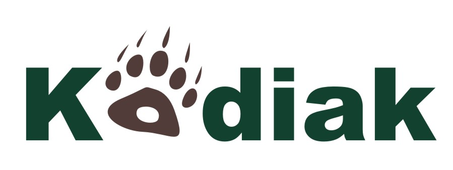

*Kodiak*, a C++ Library for Rigorous Branch and Bound Computation
=================================================================

*Kodiak* is a C++ library that implements a generic branch and bound
algorithm for rigorous numerical approximations. Particular instances
of the branch and bound algorithm allow the user to refine and
isolate solutions to systems of nonlinear equations and inequalities,
global optimization problems, and bifurcation sets for systems of
ODEs. Kodiak utilizes interval arithmetic (via the *filib++* library)
and Bernstein enclosure (for polynomials and rational functions) as
self-validating enclosure methods. Symbolic operations support
procedures such as automatic partial differentiation.

### Authors

Cesar A. Munoz (cesar.a.munoz@nasa.gov), NASA Langley Research Center

Marco A. Feliu (marco.feliu@nianet.org), National Institute of Aerospace

### Other Contributors

Andrew P. Smith, formerly at National Institute of Aerospace, US.

Anthony Narkawicz, formerly at NASA Langley Research Center, US. 

Mantas Markevicius, formerly at University of York, UK.

### Documentation

Currently, the main documentation is contained in this file.
Publications concerning the library and associated algorithms are in
preparation. There are also numerous comments in the source code.

### Support and Contribution

See the instructions in this file and the linked resources.
For further assistance, or to report problems and bugs, please
contact the authors. Contributions to the library are welcomed.

Obtaining *Kodiak*
------------------

The repository is located at:
[https://github.com/nasa/Kodiak/](https://github.com/nasa/Kodiak/)

License
-------

The Kodiak C++ Library is released under NASA's Open Source Agreement.
See the files `LICENSES/Kodiak-NOSA.pdf` and `LICENSES/Kodiak-BooleanChecker-NOSA.pdf`;
see also the copyright notice at the end of this file.

Installation and Usage Options
------------------------------

*Kodiak* is installed from source code.
*Kodiak* is run by encoding a problem in a C++ program file, then compiling and running it.

### 2. Prerequisites

It is recommended to run *Kodiak* on a Linux or Mac computer with the
GNU C++ compiler; so far it has been successfully tested on Ubuntu Linux
and Mac OS X. Use of Windows is not supported, although it ought to be
feasible, and the authors would welcome any report of successfully
running the software on Windows or any other system.

The following software should firstly be installed, if not already
present (please follow the links for instructions and support):

* *CMake* build tool (required):
  [https://cmake.org](https://cmake.org)

* *Boost* libraries (required):  
  [http://www.boost.org/users/download/](http://www.boost.org/users/download/)  
  In addition to the headers, you need at least the library
  `serialization`. This library can be installed using 
  `
  ./bootstrap.sh --with-libraries=serialization
  `
  and then `sudo ./b2 install`. Finally, you need to define the environment
  variable `BOOST_ROOT` to point to the directory where Boost's
  `include` and `lib` directories were installed, e.g., `/usr/local`.

* *filib++* interval library (required):
  [http://www2.math.uni-wuppertal.de/wrswt/software/filib.html](http://www2.math.uni-wuppertal.de/wrswt/software/filib.html)
  This library should be configured with the following options before making (`make` command)
  and installing it (maybe `sudo` will be needed preppended to the `make install` command in order to
  install the files in `/usr/local`):
  `
  ./configure CFLAGS=-fPIC CPPFLAGS=-fPIC CXXFLAGS=-fPIC
  `

### 2. Build Library and Examples

If necessary, unzip the zip file in order to extract the files.
The following files and directories should be present:

* In the working directory: this `README.md` file and a `CMakeListst.txt` file
* `LICENSES`: licenses and copyrights for *Kodiak*
* `logo`: *Kodiak*'s logo and credits
* `src`: source code for the library
* `examples`: example C++ files  (`.cpp`) containing several problems

If any of the prerequisite libraries were installed in non-standard
directories, then the file `CMakeLists.txt` should be modified accordingly.

Create a `build` directory to keep the compiled libraries and make it
the current working directory:
```
$ mkdir build
$ cd build
```

Now, run *CMake* for creating the build scripts:
```
$ cmake ..
```

Finally, build all targets by invoking the *CMake* build command:
```
$ cmake --build .
```

Using the Library
-----------------

The *Kodiak* library is used in your own C/C++ programs.
A good way to start is to take one of the existing `.cpp`
files in the `examples` directory and adapt it to your purposes.
You can either invoke the compiler directly with a link to the
*filib++* and *Kodiak* libraries, or else add a new entry to
the `examples/CMakeLists.txt` file.
For C programs, please use the `src/Adapters/Codiak.h` header file to invoke *Kodiak*'s routines.

Be aware that care must be taken with the order in which commands
are invoked. All variables should be declared before any variable
resolutions are set.

## Version

*Kodiak v-2.0* (November 2017)

## Logo
The Kodiak logo was designed by 
[Mahyar Malekpour](http://shemesh.larc.nasa.gov/people/mrm/publications.htm#ETC) (NASA).

## License and Copyright Notice

The code in this repository is released under NASA's Open Source
Agreement.  See the directory [`LICENSES`](LICENSES).

<pre>

Notices:

Copyright 2017 United States Government as represented by the
   Administrator of the National Aeronautics and Space Administration.
   All Rights Reserved.

Disclaimers:

No Warranty: THE SUBJECT SOFTWARE IS PROVIDED "AS IS" WITHOUT ANY
WARRANTY OF ANY KIND, EITHER EXPRESSED, IMPLIED, OR STATUTORY,
INCLUDING, BUT NOT LIMITED TO, ANY WARRANTY THAT THE SUBJECT SOFTWARE
WILL CONFORM TO SPECIFICATIONS, ANY IMPLIED WARRANTIES OF
MERCHANTABILITY, FITNESS FOR A PARTICULAR PURPOSE, OR FREEDOM FROM
INFRINGEMENT, ANY WARRANTY THAT THE SUBJECT SOFTWARE WILL BE ERROR
FREE, OR ANY WARRANTY THAT DOCUMENTATION, IF PROVIDED, WILL CONFORM TO
THE SUBJECT SOFTWARE.  THIS AGREEMENT DOES NOT, IN ANY MANNER,
CONSTITUTE AN ENDORSEMENT BY GOVERNMENT AGENCY OR ANY PRIOR RECIPIENT
OF ANY RESULTS, RESULTING DESIGNS, HARDWARE, SOFTWARE PRODUCTS OR ANY
OTHER APPLICATIONS RESULTING FROM USE OF THE SUBJECT SOFTWARE.
FURTHER, GOVERNMENT AGENCY DISCLAIMS ALL WARRANTIES AND LIABILITIES
REGARDING THIRD-PARTY SOFTWARE, IF PRESENT IN THE ORIGINAL SOFTWARE,
AND DISTRIBUTES IT "AS IS."

Waiver and Indemnity: RECIPIENT AGREES TO WAIVE ANY AND ALL CLAIMS
AGAINST THE UNITED STATES GOVERNMENT, ITS CONTRACTORS AND
SUBCONTRACTORS, AS WELL AS ANY PRIOR RECIPIENT.  IF RECIPIENT'S USE OF
THE SUBJECT SOFTWARE RESULTS IN ANY LIABILITIES, DEMANDS, DAMAGES,
EXPENSES OR LOSSES ARISING FROM SUCH USE, INCLUDING ANY DAMAGES FROM
PRODUCTS BASED ON, OR RESULTING FROM, RECIPIENT'S USE OF THE SUBJECT
SOFTWARE, RECIPIENT SHALL INDEMNIFY AND HOLD HARMLESS THE UNITED
STATES GOVERNMENT, ITS CONTRACTORS AND SUBCONTRACTORS, AS WELL AS ANY
PRIOR RECIPIENT, TO THE EXTENT PERMITTED BY LAW.  RECIPIENT'S SOLE
REMEDY FOR ANY SUCH MATTER SHALL BE THE IMMEDIATE, UNILATERAL
TERMINATION OF THIS AGREEMENT.

</pre>
